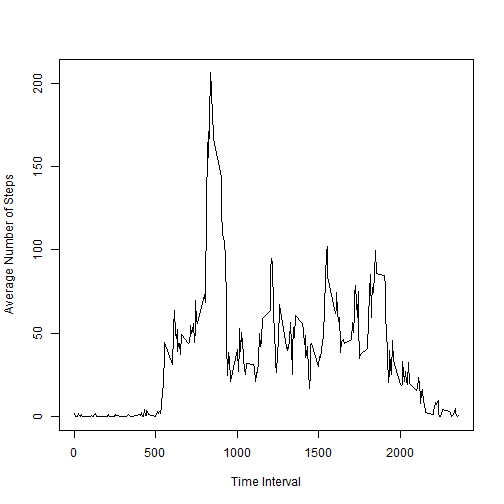
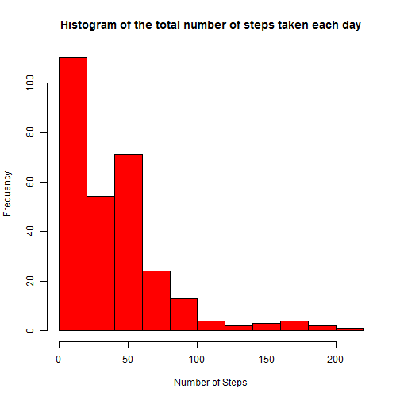

Loading and preprocessing the data
========================================================

In this section we load the data into R and make transformation on the date column to be read as date and not as factor.


```r
data <- read.csv("activity.csv", na.strings = "NA")  ##1##

data$date <- as.Date(data$date)  ##2##
```


What is mean total number of steps taken per day?
========================================================

1. Plot a histogram of the total number of steps taken in each day.


```r
good <- complete.cases(data$steps, data$date)  ## Ignore NAs
plotdata <- data[good, ]  ## Ignore NAs

## aggregate based on total steps per date##
totalperday <- aggregate(plotdata$steps, list(Date = plotdata$date), data = plotdata, 
    mean)

## plot histogram##
hist(totalperday$x, main = "Histogram of the total number of steps taken each day", 
    xlab = "Number of Steps", col = "red")
```

 

```r

mean <- mean(totalperday$x)

median <- median(totalperday$x)
```


2. Then mean of the number of steps taken per day is 37.3826 and the median of the steps
taken per day is 37.3785.

What is the average daily activity pattern?
================================================

1. Plot number of steps averaged across all days

```r
good <- complete.cases(data$steps, data$date)  ## Ignore NAs
plotdata <- data[good, ]  ## Ignore NAs

## aggregate based on total steps per interval##
total <- aggregate(plotdata$steps, list(Interval = plotdata$interval), data = plotdata, 
    mean)

## plot graph##
plot(total$Interval, total$x, type = "l", ylab = "Average Number of Steps", 
    xlab = "Time Interval")
```

 

```r

## Find maximum time interval
whichmax <- which.max(total$x)
max <- total$Interval[whichmax]
```

2. The interval [835,840] contains the maximum number of steps, averaged across all days.

Inputing missing values
===============================


```r
na <- sum(is.na(data$steps))
```

1. The number of missing values in the dataset is 2304.

2. If a value for a 5-minute interval is missing we set the value to be the mean of that 5-minute interval averaged across all days.

3. Plot histogram of the total number of steps per day of the new dataset with the filled missing values.


```r
good <- complete.cases(data$steps, data$date)  ## Ignore NAs
plotdata <- data[good, ]  ## Ignore NAs

## aggregate based on total steps per interval##
total <- aggregate(plotdata$steps, list(Interval = plotdata$interval), data = plotdata, 
    mean)

## create new dataset##
newdata <- data
newdata$steps = NULL

## Fill the NA values##
new <- is.na(data$steps)

for (i in 1:length(data$steps)) {
    if (new[i] == "TRUE") {
        
        if (i%%288 == 0) {
            newdata$steps[i] = total$x[288]
        } else {
            newdata$steps[i] = total$x[i%%288]
        }
    } else newdata$steps[i] = data$steps[i]
}


## aggregate based on total steps per interval##
totalnew <- aggregate(newdata$steps, list(Interval = newdata$interval), data = newdata, 
    mean)

## Plot the histogram of the new data##
hist(totalnew$x, main = "Histogram of the total number of steps taken each day", 
    xlab = "Number of Steps", col = "red")
```

 

```r


newmean <- mean(totalnew$x)

newmedian <- median(totalnew$x)
```


The new mean of the number of steps taken per day is 37.3826 and the new median of the steps taken per day is 34.1132.

 
Are there differences in activity patterns between weekdays and weekends?
=========================================================================

Create a new factor variable in the dataset which indicates whether a day is weekday or weekend.


```r
## create a new factor in newdata set##
for (i in 1:length(newdata$date)) {
    
    if (weekdays(newdata$date[i]) %in% c("Saturday", "Sunday")) {
        
        newdata$index[i] = "weekend"
        
    } else {
        newdata$index[i] = "weekday"
    }
    
}
```

Panel plot containing a time series plot of the 5-minute interval (x-axis) and the average number of steps taken, averaged across all weekday days or weekend days (y-axis).


```r
## Find mean of days based on weekday or weekend##
totaldays <- aggregate(newdata$steps, list(days = newdata$index, interval = newdata$interval), 
    data = newdata, mean)

## Plot steps averaged across weekends or weekdays
library(lattice)
xyplot(x ~ interval | days, data = totaldays, type = "l", layout = c(1, 2), 
    xlab = "Interval", ylab = "Number of Steps")
```

 

